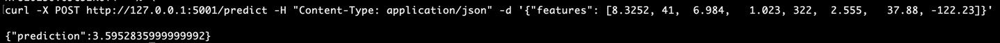

# ML Model Pipeline

## California Housing Price Prediction API
An API to predict housing price model in California. This basically demonstrates to deploy a model on k8s using containerized image.

## Steps

1. Model Training
    - Model will be trained using data and model will exported into pickle file using script [src/model_training.py](src/model_training.py)
    - And once script is executed , Model will be generated at path: models/california_housing_model.pkl
2. Containerize the model 
    - Create an API using Flask as shown in [app.py](app.py)
    - Containerize the model using [Dockerfile](Dockerfile).
    - This will expose the api over port 5001

## Running Locally

1. Please use [Makefile](Makefile) to run all commands
2. Use command `make docker-compose-up` to run the container.
3. Once container is up and running, you can test the output of model by executing command `make run-api` which basically run commands
```shell
curl -X POST http://127.0.0.1:5001/predict -H "Content-Type: application/json" -d '{"features": [8.3252, 41,  6.984,   1.023, 322,  2.555,   37.88, -122.23]}'
```
This should return the output


## Source Data
This dataset was obtained from the StatLib repository using sklearn:
https://www.dcc.fc.up.pt/~ltorgo/Regression/cal_housing.html